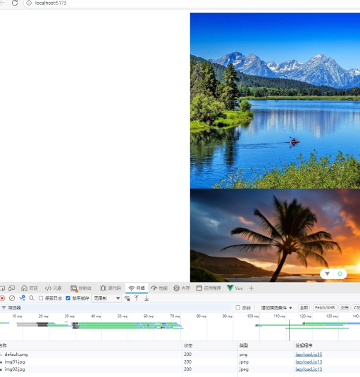

# 图片懒加载在 Vue 项目中的通用封装

## 实现原理

**利用Intersection Observer API监听图片是否进入视口，配合自定义指令v-lazyload实现解耦与复用，并通过placeholder和error处理提升用户体验**。

<!-- truncate -->

## 实现步骤

1. 创建指令文件directives/lazyload.js
2. 指令核心生命周期：在mounted钩子中初始化观察，在unmounted钩子中停止观察。
3. 指令值 (value)：用于接收图片的真实 URL。
4. 占位图与错误处理：使用本地或统一的低质量占位图（LQIP），并监听图片的error事件。

## 代码示例

自定义指令lazyload.js

```javascript
import defaultImage  from  '../../public/img/default.png'
import errorImage  from '../../public/img/error.png'
 
export const lazyLoadDirective = {
  mounted(el, binding) {
    // 1. 使用 Intersection Observer
    const observer = new IntersectionObserver((entries) => {
      entries.forEach(entry => {
        // 2. 判断是否进入视口
        if (entry.isIntersecting) {
          // 3. 进入视口后，开始加载真实图片
          const img = new Image();
          img.src = binding.value; // 指令绑定的值，即真实图片URL
 
          // 4. 图片加载成功
          img.onload = () => {
            el.src = binding.value; // 将真实图片URL设置给img标签的src
            observer.unobserve(el); // 停止观察该元素（已加载，无需再观察）
          };
 
          // 5. 图片加载失败
          img.onerror = () => {
            el.src = errorImage;
          };
 
          observer.unobserve(el); // 无论如何，停止观察
        }
      });
    }, {
      rootMargin: '0px 0px 100px 0px', // 提前100px进入视口就开始加载
      threshold: 0.1 // 当10%的图片可见时触发
    });
 
    // 6. 先设置占位图，并开始观察
    el.src = defaultImage;
    observer.observe(el);
 
    // 7. 将observer保存在元素上，便于在unmounted时断开连接
    el._lazyLoadObserver = observer;
  },
  unmounted(el) {
    // 组件卸载时，停止监听，防止内存泄漏
    if (el._lazyLoadObserver) {
      el._lazyLoadObserver.disconnect();
    }
  }
};
```


在项目中使用

```vue
<script setup>
const imgList = ['/img/img01.jpg',
  '/img/img02.jpg',
  '/img/img03.jpg',
  '/img/img04.jpg',
  '/img/img05.jpg',
  '/img/img06.jpg',
  '/img/img07.jpg',
  '/img/img08.jpg',
  '/img/img09.jpg'
]

</script>

<template>
  <div v-for="value in imgList" :key="value">
    
  </div>
</template>

<style scoped>
div {
  display: flex;
  flex-direction: column;
  justify-content: center;
  align-items: center;
}

img {
  display: block;
  width: 800px;
  height: 500px;
}
</style>

```


## 效果图

没有展示的图片没有加载，只加载视口的图片


