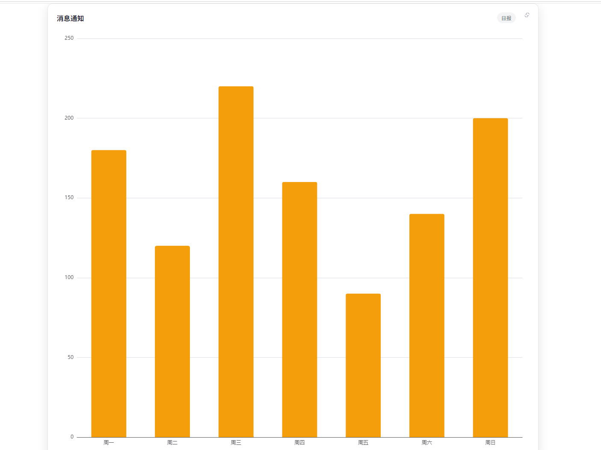

# 卡片容器页面 —— 技术实现说明

一个 Vue 3 + Vite 的图表卡片页：8 张卡片两列排布，每张内嵌一个 ECharts 图表，点右上角按钮可让卡片在容器内铺满 / 还原。样式使用 Tailwind CSS v4 工具类，无组件内 `<style scoped>`。

> 完整源码见[第九节](#九完整源码)。

## 实现效果



## 一、文件结构

| 文件 | 职责 |
| --- | --- |
| `src/App.vue` | 页面外壳：顶部导航在「卡片仪表盘」与「数据表格」间切换，仅保留导航与全局 `body { margin:0 }` 样式 |
| `src/components/CardDashboard.vue` | 卡片仪表盘：卡片数据、行容器 + 卡片结构、Tailwind 工具类、展开状态消费 |
| `src/components/EChart.vue` | ECharts 通用封装：按需注册、初始化、尺寸自适应、销毁 |
| `src/chart-options.js` | 8 套 ECharts option，按 key 取用 |
| `src/composables/useExpandable.js` | 展开 / 折叠的状态逻辑（可复用） |
| `src/style.css` | `@import "tailwindcss";`，在 `main.js` 引入，由 `vite.config.js` 的 `@tailwindcss/vite` 插件编译 |
| `src/main.js` | 应用入口，引入 `style.css` 后再挂载 `App` |

数据流：

```
cards[].chart  →  chartOptions[key]  →  <EChart :option="..." />
                                              ↓
                                   useExpandable() 控制铺满 / 还原
```

## 二、布局：卡片宽 50%、自动换行

布局用「单个 flex 换行容器」承载所有卡片，每张卡片固定 50% 宽度、自动排成两列，数量增减时自然换行，不再按固定行数切分。对应 Tailwind 工具类：

```html
<!-- 单个换行容器：flex-wrap 自动换行，行/列间距均 20px -->
<div class="relative flex flex-wrap gap-5">      <!-- gap-5 = 20px -->

  <!-- 卡片：宽 50%（减去半格 gap）自动两列；min-height 360px -->
  <article class="min-h-[360px] w-[calc(50%-0.625rem)] flex flex-col p-5 ...">
```

- 数据直接 `v-for="card in cards"` 渲染，不再用 `cardRows` 预切成「每行两张」的二维数组；卡片增删时由 `flex-wrap` 自动重排。
- 每张卡片 `w-[calc(50%-0.625rem)]`：容器 `gap-5` 为 20px，半格 10px = `0.625rem`，两卡宽度 + 一个 gap = `(50% - 10px) × 2 + 20px = 100%`，恰好两列铺满，超出即换行。
- `min-height: 360px`（不是 `height`），内容多时可继续被顶高，不会截断。
- 8 张卡片 = 4 行 ≈ 1500px，加页面上下各 40px 内边距 ≈ 1580px，超出视口后页面自然出现纵向滚动条。
- 窄屏回退单列：给容器加 `max-[640px]:flex-col`，或把卡片宽度改为 `max-[640px]:w-full` 即可，按需启用。

### 卡片头部

卡片头部只有标题（`text-base text-gray-800`）和标签（`px-2.5 py-1 rounded-full bg-gray-100 text-xs text-gray-600 whitespace-nowrap`），没有描述区，8 张卡片头部高度一致。

## 三、展开 / 折叠：容器内铺满（非浏览器全屏）

**没有使用** `requestFullscreen()` 等浏览器全屏 API，纯 CSS 实现（Tailwind 的 `absolute inset-0 z-[2]`）。

关键点：

1. **卡片容器必须 `relative`**（Tailwind `relative`），否则绝对定位会向上找到 `body`，变成铺满整页。
2. 展开卡片是容器内的一张 `<article>`，其包含块是最近的定位祖先——即带 `relative` 的 flex 换行容器，所以 `inset-0` 正好等于铺满整个容器。同时卡片 `position: absolute` 脱离 flex 行流，不再占行内格子（配合下面的「其余卡片 `hidden`」一起生效）。
3. **50% 宽度只对非展开态生效**：`w-[calc(50%-0.625rem)]` 仅在 `!isExpanded` 分支里；展开态不设这个宽度，`inset-0`（left:0 + right:0）便会撑满容器 **100% 宽**，不会被 50% 宽度覆盖。
4. 状态用「当前展开的卡片 id」而不是布尔值，天然保证同时只展开一张（见 `useExpandable`）。

展开态的卡片类（Tailwind）：

```html
<article
  :class="{
    'relative w-[calc(50%-0.625rem)] hover:-translate-y-1 hover:shadow-[0_8px_20px_rgba(0,0,0,0.08)]': !isExpanded(card.id),
    'absolute inset-0 z-[2] shadow-[0_8px_24px_rgba(0,0,0,0.1)] hover:transform-none': isExpanded(card.id),
    'hidden': isAnyExpanded && !isExpanded(card.id),
  }">
```

**展开后占满整个容器**：默认页面是 `max-w-[1200px]` 居中、带 `p-10`（40px 24px）内边距；一旦有卡片展开，页面加上 `max-w-none p-0`，解除宽度限制与内边距，绝对定位的展开卡片 `inset-0` 便直接铺满整个内容区（到边）。

## 四、展开态不出现滚动条

四处配合，缺一不可（现为 Tailwind 工具类 + `App.vue` 全局 `body { margin:0 }`）：

```html
<!-- 1. 页面：至少一屏高的纵向 flex -->
<div class="flex-1 min-h-0 flex flex-col max-w-[1200px] w-[60%] mx-auto"
     :class="{ 'p-10': !isAnyExpanded, 'max-w-none p-0': isAnyExpanded }">

<!-- 2. 展开时容器吃掉整屏剩余高度 -->
<div class="relative flex flex-wrap gap-5" :class="{ 'flex-1 min-h-0': isAnyExpanded }">

<!-- 3. 其余卡片不参与高度计算 -->
<!-- 'hidden': isAnyExpanded && !isExpanded(card.id)  加在非展开卡片上 -->

<!-- 4. 全局：清掉 body 默认 8px 外边距（App.vue 内不带 scoped 的 <style> 块） -->
<!-- body { margin: 0; } -->
```

- 第 3 条是核心：其余卡片即便被遮住，只要在文档流里，容器高度仍是 ~1500px，展开卡片会被拉成一整屏列表那么高。
- 第 2 条用 `flex-1` 而不是 `height: calc(100vh - 80px)`，避免把内边距数值写死两处。
- 第 4 条不能省：body 默认上下各 8px，总高会变成 `100vh + 16px`，刚好又冒出滚动条。因为要作用于全局，`App.vue` 里用了第二个不带 `scoped` 的 `<style>` 块。

结果：文档总高正好 100vh，展开态无滚动条；收起后内容 ~1580px，滚动条回来。

## 五、ECharts 集成

### 按需注册

```js
import * as echarts from 'echarts/core'
import { LineChart, BarChart, PieChart, RadarChart, ScatterChart, GaugeChart } from 'echarts/charts'
import { GridComponent, TooltipComponent, LegendComponent, RadarComponent } from 'echarts/components'
import { CanvasRenderer } from 'echarts/renderers'

echarts.use([/* ... */])
```

全量 `import * as echarts from 'echarts'` 会让产物从 63KB 涨到 1184KB（gzip 397KB）；按需注册后为 645KB（gzip 221KB）。**新增图表类型时记得同步 `echarts.use()` 的注册列表。**

### 生命周期

```js
onMounted(() => {
  chart = echarts.init(el.value)
  chart.setOption(props.option)

  // 观察父容器（.card-chart）的尺寸变化：窗口缩放、卡片展开/收起都会改变它，尺寸一变就 resize
  observer = new ResizeObserver(() => {
    chart && chart.resize()
  })
  observer.observe(el.value.parentElement)
})

// 展开/收起切换：DOM 更新后强制 resize，确保图表重新读取容器尺寸并铺满
watch(
  () => props.expanded,
  async () => {
    await nextTick()
    chart && chart.resize()
  }
)

onBeforeUnmount(() => {
  observer.disconnect()   // 先停监听，避免销毁后仍回调 resize
  chart.dispose()
})
```

图表随容器尺寸自适应：

- 父容器尺寸变化（窗口缩放、卡片展开 / 收起）时，通过 `ResizeObserver` 触发 `chart.resize()`。
- 卡片展开态切换后，`watch(expanded)` 在 DOM 更新后强制 `chart.resize()`。
- `.echart` 用 `width/height: 100%` 始终等于父容器大小。
- `option` 整体替换时也会 `setOption(option, true)` 重绘（换数据源用）。

### 使用约定

`<EChart>` 的根节点是 `position: absolute; inset: 0`，因此**父容器必须 `position: relative` 且高度由 CSS 确定**（固定值或 flex 分配均可）。

## 六、图表区结构

`<EChart>` 根节点为 `position: absolute; inset: 0`，因此卡片图表区必须 `position: relative` 且高度由 CSS 确定（固定值或 flex 分配）。在 Tailwind 下写作：

```html
<div class="relative flex-1 min-h-0 overflow-hidden">
  <EChart :option="chartOptions[card.chart]" :expanded="isExpanded(card.id)" />
</div>
```

这种「父 relative + 子 absolute」结构让图表尺寸单向跟随卡片：卡片高度决定图表区的高度，图表再跟随它，图表不会反向把卡片撑高。`flex-1 min-h-0 overflow-hidden` 在 flex 布局中吃掉卡片剩余高度、可收缩并裁掉溢出（收起瞬间画布还没缩回时先裁掉，避免溢出压到下面的卡片）。

## 七、状态逻辑复用

`src/composables/useExpandable.js`：

```js
export function useExpandable() {
  const expandedId = ref(null)
  const isAnyExpanded = computed(() => expandedId.value !== null)
  const isExpanded = (id) => expandedId.value === id
  function toggle(id) {
    expandedId.value = expandedId.value === id ? null : id
  }
  return { expandedId, isAnyExpanded, isExpanded, toggle }
}
```

在新页面复用的三步：

1. `const { isAnyExpanded, isExpanded, toggle } = useExpandable()`
2. 页面根节点 `:class="{ 'max-w-none p-0': isAnyExpanded }"`，行容器 `:class="{ 'flex-1 min-h-0': isAnyExpanded }"`，卡片 `:class` 里绑定 `relative` / `absolute inset-0 z-[2]` 与 `hidden`。
3. 这些 `:class` 绑定就是「样式契约」——不再依赖 scoped CSS 里的 `.is-expanded` / `.card-expanded` 选择器。

隐含依赖：行容器展开时 `flex-1` 要求外层是 `min-height: 100vh` 的纵向 flex（即 `.app`）。若新页面结构不同，改用 `height: calc(100vh - 页面上下内边距)` 效果相同。

## 八、已知限制与扩展方向

- **展开 / 收起是瞬时的**：`position` 在 `relative` ↔ `absolute` 之间切换无法用 `transition` 过渡。要做动画有两条路：
  - View Transitions API（最省事）：`document.startViewTransition(async () => { toggle(id); await nextTick() })`，配合每张卡片唯一的 `view-transition-name`，十几行搞定，老浏览器自动降级为瞬时切换。
  - FLIP：切换前后各测一次 `getBoundingClientRect()`，用 Web Animations API 补间 `transform` + `width` / `height`。要注意此时卡片不能是 `display: none`，否则测量全是 0。
- **`hidden`（原 `display: none`）的影响**：元素不生成布局盒，`getBoundingClientRect()` 全 0，不进无障碍树；但 Vue 组件不销毁、DOM 节点和状态都保留，图片也仍会下载。卡片里若放需要容器尺寸的库（如 ECharts），当前的 `ResizeObserver` 方案已能自动恢复。
- **行内始终等高**：同一行是 flex，默认 `align-items: stretch`，两张卡等高取较高者；较矮那张的图表区（`flex-1`）自动撑大吸收差值，图表经 `ResizeObserver` 重绘不变形，`min-height: 360px` 兜底下限。构建无报错、图表不拉伸、行内始终对齐。唯一限制是「行内等高、行与行可不等高」——若要求 8 张全部严格齐平，需把行高锁死（固定行高 + `overflow` 处理超长内容）。
- **产物体积**：Vite 会提示 chunk > 500KB，是因为同时用到了 6 种图表类型。继续瘦身可删掉 `echarts.use()` 中没用到的类型。
- **`defineProps` 是编译宏**：只在 `<script setup>` 中由编译器注入，普通 `<script>` 块里不可用，也不能从 `'vue'` 导入。普通 `<script>` 里要声明 props，请改用 `export default { props: {...}, setup(props) {...} }`。

## 九、完整源码

### `src/App.vue`

```vue
<script setup>
import { ref } from 'vue'
import CardDashboard from './components/CardDashboard.vue'
import DataTable from './components/DataTable.vue'

// 当前视图：'cards' 卡片仪表盘 / 'table' 数据表格
const view = ref('cards')
</script>

<template>
  <div class="app">
    <nav class="top-nav">
      <button type="button" :class="{ active: view === 'cards' }" @click="view = 'cards'">卡片仪表盘</button>
      <button type="button" :class="{ active: view === 'table' }" @click="view = 'table'">数据表格</button>
    </nav>

    <CardDashboard v-if="view === 'cards'" />
    <DataTable v-else />
  </div>
</template>

<style scoped>
.app {
  display: flex;
  flex-direction: column;
  min-height: 100vh;
}

/* 顶部导航：在卡片仪表盘与数据表格之间切换 */
.top-nav {
  display: flex;
  gap: 8px;
  max-width: 1200px;
  width: 100%;
  margin: 0 auto;
  padding: 16px 24px;
  box-sizing: border-box;
}

.top-nav button {
  padding: 8px 16px;
  border: 1px solid #e5e7eb;
  border-radius: 8px;
  background: #fff;
  color: #374151;
  font-size: 14px;
  cursor: pointer;
  transition: all 0.15s ease;
}

.top-nav button:hover {
  border-color: #3b82f6;
  color: #3b82f6;
}

.top-nav button.active {
  background: #3b82f6;
  border-color: #3b82f6;
  color: #fff;
}
</style>

<!-- 全局：去掉 body 默认外边距，否则展开态会多出 16px 撑出滚动条 -->
<style>
body {
  margin: 0;
}
</style>
```

### `src/components/CardDashboard.vue`

```vue
<script setup>
import EChart from './EChart.vue'
import { chartOptions } from '../chart-options.js'
import { useExpandable } from '../composables/useExpandable.js'

// 卡片数据：chart 字段指定用哪套 ECharts 配置，见 chart-options.js
const cards = [
  { id: 1, title: '数据总览', tag: '趋势', chart: 'line' },
  { id: 2, title: '任务进度', tag: '完成度', chart: 'gauge' },
  { id: 3, title: '消息通知', tag: '日报', chart: 'bar' },
  { id: 4, title: '系统设置', tag: '来源', chart: 'pie' },
  { id: 5, title: '用户管理', tag: '角色', chart: 'ring' },
  { id: 6, title: '数据统计', tag: '增量', chart: 'area' },
  { id: 7, title: '日志审计', tag: '评分', chart: 'radar' },
  { id: 8, title: '帮助中心', tag: '分布', chart: 'scatter' },
]

// 展开/折叠状态
const { isAnyExpanded, isExpanded, toggle } = useExpandable()
</script>

<template>
  <div class="flex-1 min-h-0 flex flex-col max-w-[1200px] w-[60%] mx-auto"
    :class="{ 'p-10': !isAnyExpanded, 'max-w-none p-0': isAnyExpanded }">
    <div class="relative flex flex-wrap gap-5" :class="{ 'flex-1 min-h-0': isAnyExpanded }">
      <article v-for="card in cards" :key="card.id"
        class="min-h-[360px] flex flex-col p-5 bg-white border border-[#e8e8e8] rounded-xl transition duration-150"
        :class="{
          'relative w-[calc(50%-0.625rem)] hover:-translate-y-1 hover:shadow-[0_8px_20px_rgba(0,0,0,0.08)]': !isExpanded(card.id),
          'absolute inset-0 z-[2] shadow-[0_8px_24px_rgba(0,0,0,0.1)] hover:transform-none': isExpanded(card.id),
          'hidden': isAnyExpanded && !isExpanded(card.id),
        }">
          <button class="absolute top-3 right-3 flex items-center justify-center w-7 h-7 p-0 border-0 rounded-md bg-transparent text-gray-400 cursor-pointer transition-colors hover:bg-gray-100 hover:text-gray-700"
            type="button" :aria-label="isExpanded(card.id) ? '收起' : '展开'"
            :title="isExpanded(card.id) ? '收起' : '展开'" @click="toggle(card.id)">
            <svg viewBox="0 0 24 24" width="14" height="14" aria-hidden="true">
              <path v-if="isExpanded(card.id)" d="M5 9h6V3M19 15h-6v6M15 3l6 6M9 21l-6-6" fill="none"
                stroke="currentColor" stroke-width="2" stroke-linecap="round" />
              <path v-else d="M15 3h6v6M9 21H3v-6M21 3l-7 7M3 21l7-7" fill="none" stroke="currentColor" stroke-width="2"
                stroke-linecap="round" />
            </svg>
          </button>
          <header class="flex items-center justify-between gap-2 mb-3 pr-8">
            <h3 class="m-0 text-base text-gray-800">{{ card.title }}</h3>
            <span class="px-2.5 py-1 rounded-full bg-gray-100 text-xs text-gray-600 whitespace-nowrap">{{ card.tag }}</span>
          </header>
          <div class="relative flex-1 min-h-0 overflow-hidden">
            <EChart :option="chartOptions[card.chart]" :expanded="isExpanded(card.id)" />
          </div>
        </article>
    </div>
  </div>
</template>
```

### `src/style.css`

```css
@import "tailwindcss";
```

### `src/main.js`

```js
import { createApp } from 'vue'
import './style.css'
import App from './App.vue'

createApp(App).mount('#app')
```

### `src/vite.config.js`

```js
import { defineConfig } from 'vite'
import vue from '@vitejs/plugin-vue'
import tailwindcss from '@tailwindcss/vite'

// https://vite.dev/config/
export default defineConfig({
  plugins: [vue(), tailwindcss()],
})
```

### `src/components/EChart.vue`

```vue
<script setup>
import { ref, watch, nextTick, onMounted, onBeforeUnmount } from 'vue'
import * as echarts from 'echarts/core'
import {
  LineChart,
  BarChart,
  PieChart,
  RadarChart,
  ScatterChart,
  GaugeChart,
} from 'echarts/charts'
import {
  GridComponent,
  TooltipComponent,
  LegendComponent,
  RadarComponent,
} from 'echarts/components'
import { CanvasRenderer } from 'echarts/renderers'

// 按需注册：只打包用到的图表和组件（全量引入会让产物增加约 900KB）
echarts.use([
  LineChart,
  BarChart,
  PieChart,
  RadarChart,
  ScatterChart,
  GaugeChart,
  GridComponent,
  TooltipComponent,
  LegendComponent,
  RadarComponent,
  CanvasRenderer,
])

const props = defineProps({
  // 标准 ECharts option
  option: { type: Object, required: true },
  // 卡片是否处于展开态：用于展开/收起后强制重绘，保证图表铺满
  expanded: { type: Boolean, default: false },
})

const el = ref(null)
let chart = null
let observer = null

onMounted(() => {
  chart = echarts.init(el.value)
  chart.setOption(props.option)

  // 观察父容器（.card-chart）的尺寸变化：窗口缩放、卡片展开/收起都会改变它，尺寸一变就 resize
  observer = new ResizeObserver(() => {
    chart && chart.resize()
  })
  observer.observe(el.value.parentElement)
})

// 展开/收起切换：DOM 更新后强制 resize，确保图表重新读取容器尺寸并铺满
watch(
  () => props.expanded,
  async () => {
    await nextTick()
    chart && chart.resize()
  }
)

// option 整体替换时重绘（换数据源用）
watch(
  () => props.option,
  (option) => chart && chart.setOption(option, true)
)

onBeforeUnmount(() => {
  // 先停监听再销毁实例，避免销毁后仍回调 resize
  if (observer) {
    observer.disconnect()
    observer = null
  }
  if (chart) {
    chart.dispose()
    chart = null
  }
})
</script>

<template>
  <div ref="el" class="echart"></div>
</template>

<style scoped>
/*
 * 绝对定位使图表尺寸单向跟随父容器：父容器高度确定后，图表填充其中，
 * 不会反向把卡片撑高。因此要求父容器 position: relative 且高度由 CSS
 * （固定值或 flex）确定。
 */
.echart {
  position: absolute;
  inset: 0;
  /* 始终等于父容器 100%，跟随卡片伸缩 */
  width: 100% !important;
  height: 100% !important;
}
</style>
```

### `src/chart-options.js`

```js
const days = ['周一', '周二', '周三', '周四', '周五', '周六', '周日']

// 用函数返回，避免多个图表共用同一个配置对象
const grid = () => ({ left: 48, right: 16, top: 24, bottom: 32 })

// 卡片 chart 字段 → 对应的 ECharts option
export const chartOptions = {
  line: {
    tooltip: { trigger: 'axis' },
    grid: grid(),
    xAxis: { type: 'category', data: days, boundaryGap: false },
    yAxis: { type: 'value' },
    series: [
      {
        name: '访问量',
        type: 'line',
        smooth: true,
        data: [120, 200, 150, 80, 70, 110, 130],
        itemStyle: { color: '#3b82f6' },
      },
    ],
  },

  gauge: {
    series: [
      {
        type: 'gauge',
        startAngle: 210,
        endAngle: -30,
        min: 0,
        max: 100,
        radius: '85%',
        progress: { show: true, width: 12 },
        axisLine: { lineStyle: { width: 12 } },
        axisTick: { show: false },
        splitLine: { length: 8, lineStyle: { width: 1 } },
        axisLabel: { distance: 14, fontSize: 10 },
        pointer: { width: 4 },
        detail: {
          valueAnimation: true,
          formatter: '{value}%',
          fontSize: 22,
          offsetCenter: [0, '65%'],
        },
        data: [{ value: 72 }],
      },
    ],
  },

  bar: {
    tooltip: { trigger: 'axis' },
    grid: grid(),
    xAxis: { type: 'category', data: days },
    yAxis: { type: 'value' },
    series: [
      {
        name: '消息数',
        type: 'bar',
        barWidth: '55%',
        data: [180, 120, 220, 160, 90, 140, 200],
        itemStyle: { color: '#f59e0b', borderRadius: [4, 4, 0, 0] },
      },
    ],
  },

  pie: {
    tooltip: { trigger: 'item' },
    legend: { bottom: 0, itemWidth: 10, itemHeight: 10 },
    series: [
      {
        type: 'pie',
        radius: ['0%', '60%'],
        center: ['50%', '45%'],
        data: [
          { name: '直接访问', value: 335 },
          { name: '邮件营销', value: 210 },
          { name: '联盟广告', value: 150 },
          { name: '搜索引擎', value: 280 },
        ],
      },
    ],
  },

  ring: {
    tooltip: { trigger: 'item' },
    legend: { bottom: 0, itemWidth: 10, itemHeight: 10 },
    series: [
      {
        type: 'pie',
        radius: ['42%', '68%'],
        center: ['50%', '45%'],
        label: { show: false },
        itemStyle: { borderColor: '#fff', borderWidth: 2 },
        data: [
          { name: '管理员', value: 12 },
          { name: '编辑', value: 28 },
          { name: '访客', value: 46 },
          { name: '禁用', value: 6 },
        ],
      },
    ],
  },

  area: {
    tooltip: { trigger: 'axis' },
    grid: grid(),
    xAxis: { type: 'category', data: days, boundaryGap: false },
    yAxis: { type: 'value' },
    series: [
      {
        name: '新增',
        type: 'line',
        smooth: true,
        data: [40, 65, 55, 90, 120, 100, 145],
        areaStyle: { opacity: 0.25 },
        lineStyle: { width: 2 },
        itemStyle: { color: '#06b6d4' },
      },
    ],
  },

  radar: {
    tooltip: {},
    radar: {
      radius: '62%',
      indicator: [
        { name: '性能', max: 100 },
        { name: '稳定', max: 100 },
        { name: '安全', max: 100 },
        { name: '易用', max: 100 },
        { name: '扩展', max: 100 },
      ],
    },
    series: [
      {
        type: 'radar',
        data: [
          { name: '当前版本', value: [85, 90, 78, 92, 70] },
          { name: '上个版本', value: [70, 75, 88, 80, 85] },
        ],
      },
    ],
  },

  scatter: {
    tooltip: { trigger: 'item' },
    grid: grid(),
    xAxis: { type: 'value' },
    yAxis: { type: 'value' },
    series: [
      {
        type: 'scatter',
        symbolSize: 12,
        itemStyle: { color: '#ec4899' },
        data: [
          [10, 20],
          [15, 34],
          [22, 28],
          [30, 46],
          [38, 40],
          [45, 60],
          [52, 55],
          [60, 72],
        ],
      },
    ],
  },
}
```

### `src/composables/useExpandable.js`

```js
import { ref, computed } from 'vue'

/**
 * 卡片「展开占满容器」的状态逻辑
 * 注意：这是纯状态，配套样式由各页面自己维护（Tailwind 的 :class 绑定）
 * @returns {{ expandedId: import('vue').Ref<number|string|null>, isAnyExpanded: import('vue').ComputedRef<boolean>, isExpanded: (id: number|string) => boolean, toggle: (id: number|string) => void }}
 */
export function useExpandable() {
  // 存 id 而不是布尔值：天然保证同时只展开一张，切换时上一张自动收起
  const expandedId = ref(null)

  // 是否有卡片处于展开态，用于给容器加类（撑高容器）
  const isAnyExpanded = computed(() => expandedId.value !== null)
  const isExpanded = (id) => expandedId.value === id

  // 再次点击同一张则收起
  function toggle(id) {
    expandedId.value = expandedId.value === id ? null : id
  }

  return { expandedId, isAnyExpanded, isExpanded, toggle }
}
```

### `index.html`

```html
<!doctype html>
<html lang="en">
  <head>
    <meta charset="UTF-8" />
    <link rel="icon" type="image/svg+xml" href="/favicon.svg" />
    <meta name="viewport" content="width=device-width, initial-scale=1.0" />
    <title>vue3-demo</title>
  </head>
  <body>
    <div id="app"></div>
    <script type="module" src="/src/main.js"></script>
  </body>
</html>
```

### `package.json`

```json
{
  "name": "vue3-demo",
  "private": true,
  "version": "0.0.0",
  "type": "module",
  "scripts": {
    "dev": "vite",
    "build": "vite build",
    "preview": "vite preview"
  },
  "dependencies": {
    "echarts": "^6.1.0",
    "vue": "^3.5.40"
  },
  "devDependencies": {
    "@tailwindcss/vite": "^4.3.3",
    "@vitejs/plugin-vue": "^6.0.8",
    "tailwindcss": "^4.3.3",
    "vite": "^8.2.0"
  }
}
```

## 附：常用命令

```bash
npm install     # 安装依赖
npm run dev     # 开发预览
npm run build   # 生产构建
npm run preview # 预览构建产物
```
