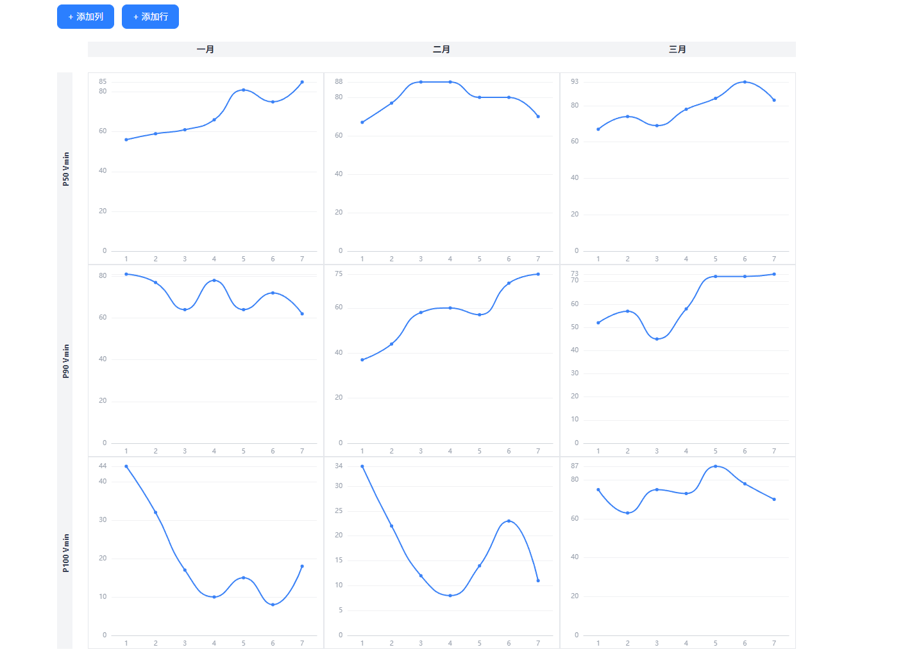

# 数据表格实现说明

描述数据表格页面（DataTable.vue）当前的界面与行为效果。

## 实现效果



## 页面入口

顶部导航（App.vue 内 `.top-nav`）在「卡片仪表盘」与「数据表格」两个页面间切换：
- 卡片仪表盘为独立组件 `src/components/CardDashboard.vue`
- 数据表格为 `src/components/DataTable.vue`，通过 App.vue 的 `v-if` / `v-else` 切换渲染

## 数据表格结构

- **列**：由 `columns` 定义，每项含 `id`（主键）与 `name`（列名）。初始为「一月 / 二月 / 三月」。
- **行**：由 `rows` 定义，每项含 `id` 与 `name`（行名）。初始为「P50 Vmin / P90 Vmin / P100 Vmin」。
- **单元格**：每个单元格渲染一个 `CellChart` 组件，内部各自维护一组 ECharts 折线图数据，本组件只保留行列结构。

## 布局效果

- 表格使用 `border-separate` + `border-spacing-0`，行列头与数据区之间由 24px 透明间隔列 / 间隔行留白。
- 左上角单元格隐藏，但保留 24px 列宽以对齐行名。
- 列名位于顶部灰色背景行（`bg-gray-100`），高度 24px。
- 行名为左侧灰色背景列，文字逆时针旋转 90° 竖向显示（`-rotate-90`），并加粗（`font-bold`）；行高 300px 以保证竖向文字完整显示。
- 数据单元格带 1px 浅灰边框（`border border-gray-200`），作为内部 ECharts 画布的包含块。
- 表格容器 `overflow-auto`，内容超出时滚动；整体页面最大宽度 1200px 居中。

## 交互

- 「+ 添加列」：向 `columns` 追加一项，列 `id` 由自增序号 + 时间戳生成，默认列名为「新列 N」。
- 「+ 添加行」：向 `rows` 追加一项，行 `id` 由自增序号 + 时间戳生成，默认行名为「新行 N」。

## 样式技术栈

- 使用 Tailwind CSS v4，组件内全部采用工具类，无 `<style scoped>`。
- 入口 `src/style.css`（`@import "tailwindcss";`）在 `src/main.js` 中引入；构建由 `vite.config.js` 中的 `@tailwindcss/vite` 插件处理。
- Tailwind 的 preflight 全局生效，会重置基础样式。

## 源代码

`src/components/DataTable.vue`：

```vue
<script setup>
import { ref } from 'vue'
import CellChart from './CellChart.vue'

// 列定义：id 唯一标识（主键），name 即列名（可编辑 → 动态列名）
const columns = ref([
    { id: 'm1', name: '一月' },
    { id: 'm2', name: '二月' },
    { id: 'm3', name: '三月' },
])

// 行定义：name 即行名（可编辑 → 动态行名）。
// 单元格的具体数据已下放到 CellChart 组件内部各自维护，这里只保留行列结构。
const rows = ref([
    { id: 'r1', name: 'P50 Vmin' },
    { id: 'r2', name: 'P90 Vmin' },
    { id: 'r3', name: 'P100 Vmin' },
])

let colSeq = 0
let rowSeq = 0

// 新增列
function addColumn() {
    const id = 'm' + ++colSeq + '_' + Date.now()
    columns.value.push({ id, name: '新列' + (columns.value.length + 1) })
}

// 删除列
function removeColumn(id) {
    columns.value = columns.value.filter((c) => c.id !== id)
}

// 新增行
function addRow() {
    const id = 'r' + ++rowSeq + '_' + Date.now()
    rows.value.push({ id, name: '新行' + (rows.value.length + 1) })
}

function removeRow(id) {
    rows.value = rows.value.filter((r) => r.id !== id)
}
</script>

<template>
    <div class="flex-1 min-h-0 w-full max-w-[1200px] mx-auto py-10 px-6 box-border">
        <div class="mb-5">
            <h2 class="m-0 mb-1 text-xl text-gray-800">数据表格</h2>
            <p class="m-0 mb-4 text-[13px] text-gray-500">行名 / 列名为文字，每个单元格为各自一组数据的 ECharts 折线图；下方按钮可新增行 / 列。</p>
            <div class="flex gap-3">
                <button type="button" class="px-4 py-2 border border-blue-500 rounded-lg bg-blue-500 text-white text-sm cursor-pointer transition-colors hover:bg-blue-600" @click="addColumn">+ 添加列</button>
                <button type="button" class="px-4 py-2 border border-blue-500 rounded-lg bg-blue-500 text-white text-sm cursor-pointer transition-colors hover:bg-blue-600" @click="addRow">+ 添加行</button>
            </div>
        </div>

        <div class="overflow-auto bg-white">
            <table class="border-separate border-spacing-0 w-full min-w-[480px]">
                <thead>
                    <tr>
                        <th class="w-6 min-w-6 invisible p-0 border-0 text-left relative"></th>
                        <th class="w-6 min-w-6 bg-transparent p-0 border-0 text-left relative"></th>
                        <th v-for="col in columns" :key="col.id" class="bg-gray-100 h-6 p-0 border-0 text-left relative">
                            <div class="flex items-center justify-center gap-1.5 px-2.5">
                                <span class="text-sm text-gray-800">{{ col.name }}</span>
                            </div>
                        </th>
                    </tr>
                </thead>
                <tbody>
                    <tr class="h-6">
                        <th class="p-0 border-0 text-left relative"></th>
                        <th class="p-0 border-0 text-left relative"></th>
                        <th class="p-0 border-0 text-left relative" v-for="col in columns" :key="col.id"></th>
                    </tr>
                    <tr v-for="row in rows" :key="row.id" class="h-[300px]">
                        <th class="bg-gray-100 font-semibold text-gray-700 w-6 min-w-6 align-bottom overflow-hidden p-0 border-0 text-left relative">
                            <div class="absolute left-1/2 top-1/2 -translate-x-1/2 -translate-y-1/2 -rotate-90 whitespace-nowrap p-1">
                                <span class="inline-block w-[110px] text-xs text-center font-bold">{{ row.name }}</span>
                            </div>
                        </th>
                        <th class="w-6 min-w-6 bg-transparent p-0 border-0 text-left relative"></th>
                        <td v-for="col in columns" :key="col.id" class="relative border border-gray-200 p-0">
                            <CellChart />
                        </td>
                    </tr>
                </tbody>
            </table>
        </div>
    </div>
</template>
```
