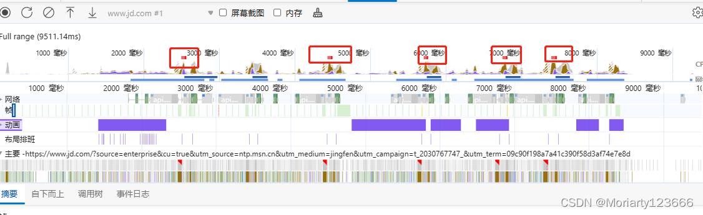
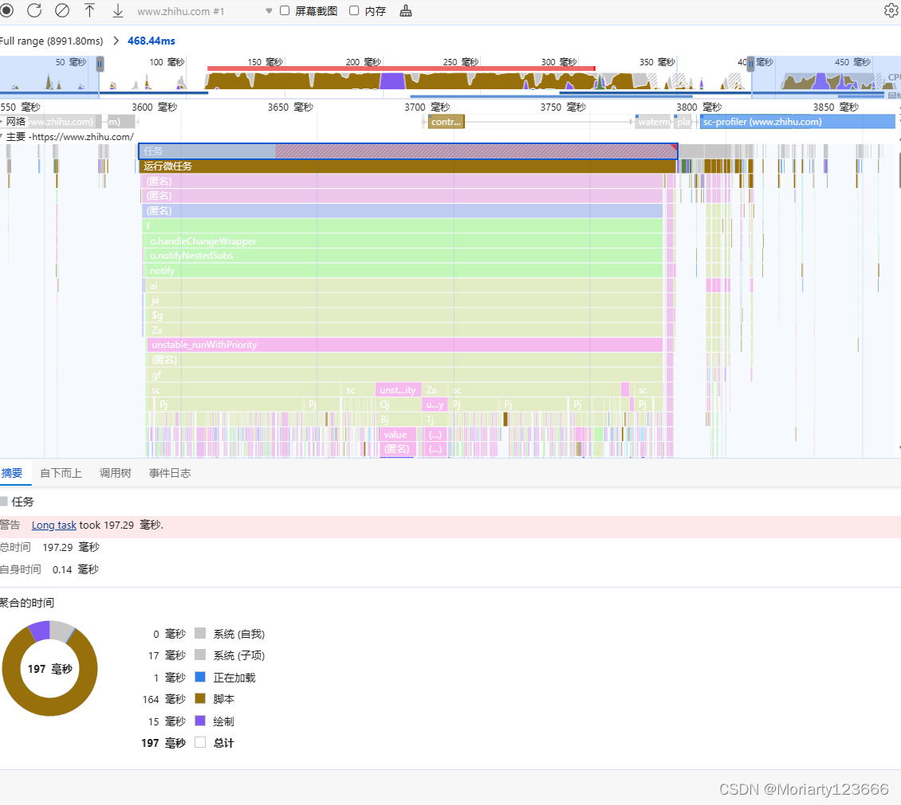
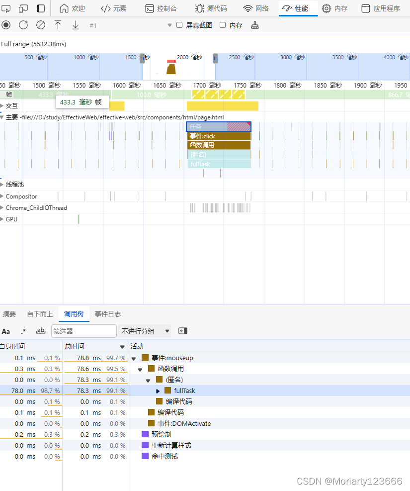
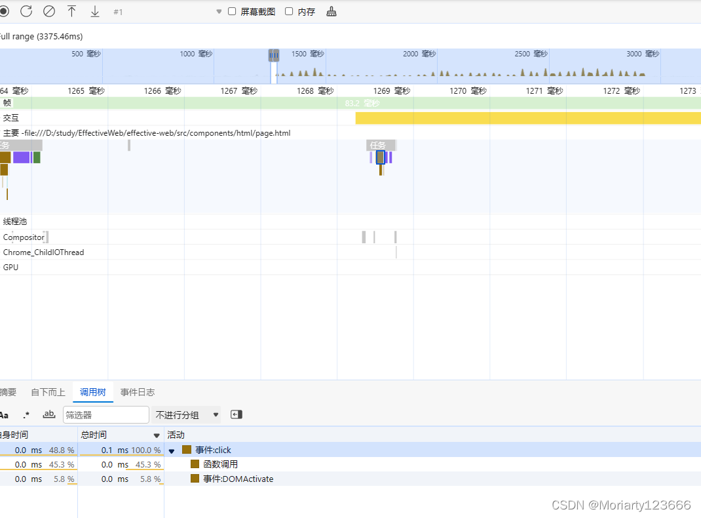
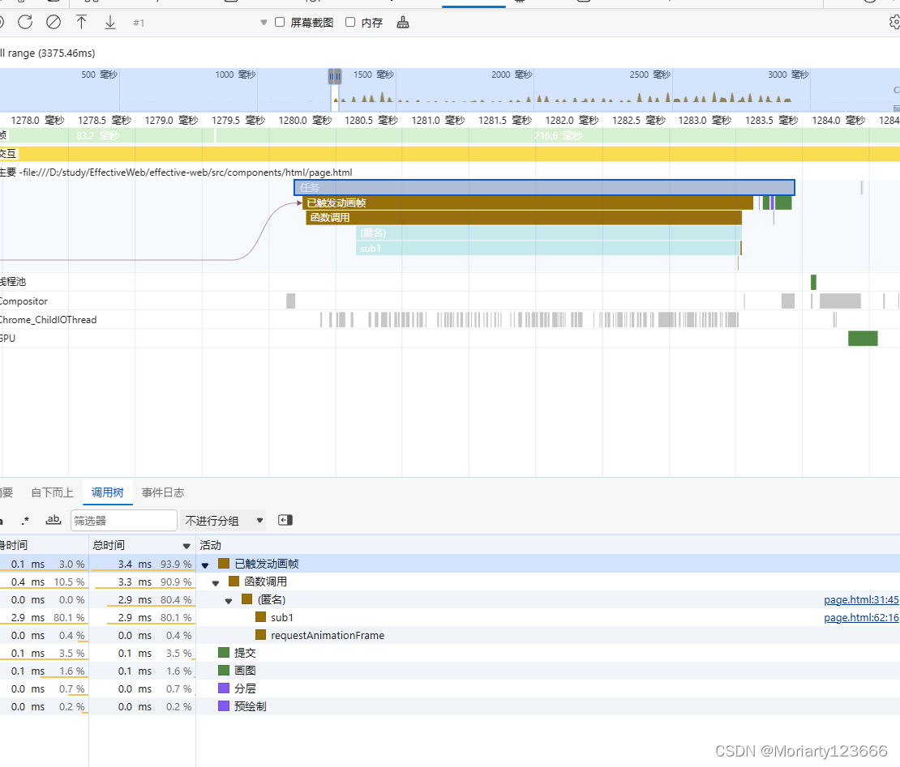
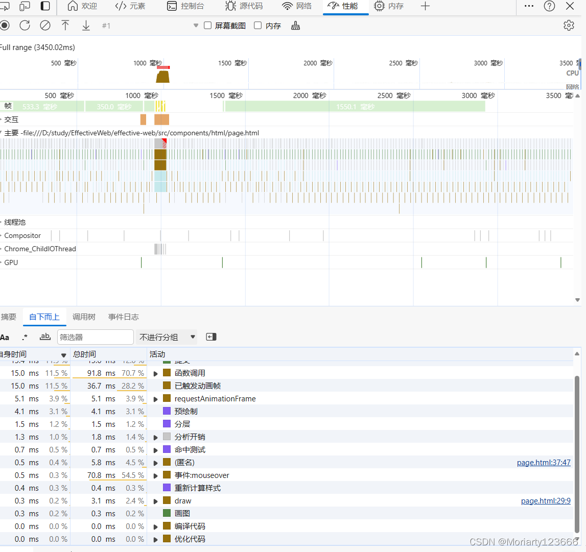
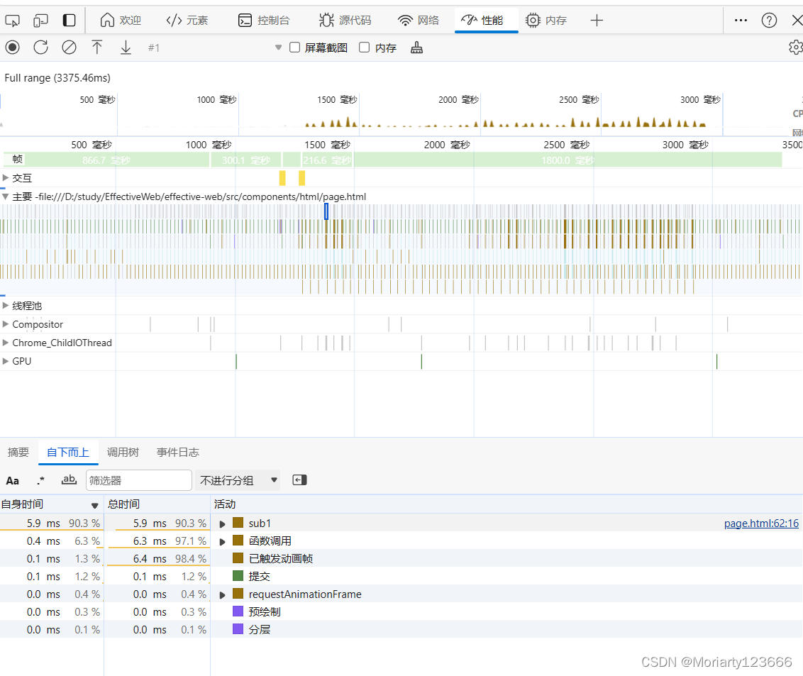
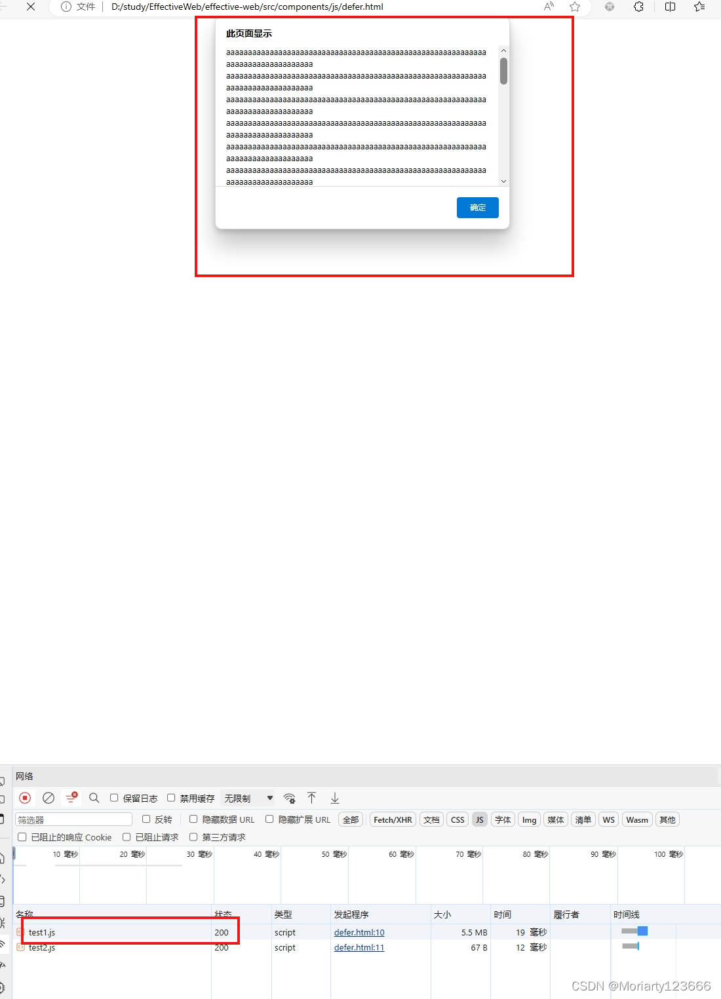
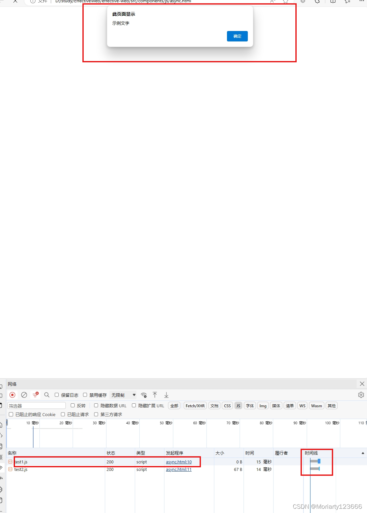

# 页面优化
## 页面渲染流程
JavaScript 》 Style 》 Layout 》 Paint 》 Composite

首先js做了一些逻辑，触发了样式变化，style计算好这些变化后，把影响的dom元素进行重新布局（layout）,再画到画布中（Paint）,最后把这个画布刷新到屏幕上（Composite）,形成一帧。

屏幕的分辨率一般是60Hz,也就是一秒要60帧，1000ms/60约等于16.67ms,加上浏览器内核自身运算也要消耗些时间，一帧差不多就10ms,渲染的过程中上面哪一步耗时长了，这一帧耗时变多，帧率就下降，页面看起来就卡。

上面的步骤不一定都会执行，页面优化可以从这些方面考虑，比如：
- js只做计算，没有增加删除dom或改变css,后面几步就不会执行。
- style只改了color/background等不需要重新layout的不用执行layout
- style改了transform属性，在edge不需要layout和Paint


## devtool调试
edge浏览器有个devtool工具，点击performance页签，记录一段时间的浏览器操作，关闭记录按钮就会生成这次操作的详细信息

这种有个小红方块的是渲染时间比较长的帧


取其中一个帧，可以看到是js执行时间比较长


## 拆分代码块
既然一个js 代码块执行太久导致卡顿，那能不能把代码拆分？
我们把代码拆分成几个单元task，每个单元控制执行不超过10ms,建立一个Task类来管理这些task，js每次渲染帧时会调用一个函数requestAnimationFrame,接受一个函数，建立一个任务队列。
```javascript
// Task定义
  class Task {
    constructor() {
      this.tasks = [];
    }
    addTask(task) {
      this.tasks.push(task);
    }

    draw() {
      let that = this; // 这里用that来代替是避免this指向问题
      window.requestAnimationFrame(function () {
        let tasks = that.tasks;
        if (tasks.length) {
          let task = tasks.shift();
          task();
        }
        window.requestAnimationFrame(function () {
          that.draw.call(that);
        });
      });
    }
  }

```

使用的时候先创建Task实例，调draw初始化，有任务时addTask添加到队尾，执行任务时调shift执行任务

```javascript
  // 用单例模式控制mapTask只有一个
  let mapTask = {
    get: function () {
      if (!atask) {
        atask = new Task();
        atask.draw();
      }
      return atask;
    },
    add: function (task) {
      mapTask.get().addTask(task);
    },
  };
```

这里举个例子，模拟执行时间长的函数
```javascript
  let fullTask = () => {
    for (let i = 0; i < 5000; i++) {
      console.log("i :>> ", i);
    }
  };
```

执行时间78.3ms



把这个函数拆分成很多给子任务去执行

```javascript
  let subTask = () => {
    let k = 0;
    let sub1 = () => {
      for (let j = 0; j < 100; j++) {
        k++;
        console.log("k :>> ", k);
      }
    };

    for (let i = 0; i < 50; i++) {
      mapTask.add(sub1);
    }
  };
```


每个sub1函数不超过10ms,这样大大减少函数执行时长。



补一个全局的对比
拆分前的：


拆分后的：


全部的代码如下：

```javascript
<!DOCTYPE html>
<html lang="en">
  <head>
    <meta charset="UTF-8" />
    <meta name="viewport" content="width=device-width, initial-scale=1.0" />
    <title>Document</title>
  </head>
  <body>
    <button onclick="fullTask()">fullTask</button>
    <button onclick="subTask()">subTask</button>
  </body>
</html>

<script>
  let fullTask = () => {
    for (let i = 0; i < 5000; i++) {
      console.log("i :>> ", i);
    }
  };

  class Task {
    constructor() {
      this.tasks = [];
    }
    addTask(task) {
      this.tasks.push(task);
    }

    draw() {
      let that = this; // 这里用that来代替是避免this指向问题
      window.requestAnimationFrame(function () {
        let tasks = that.tasks;
        if (tasks.length) {
          let task = tasks.shift();
          task();
        }
        window.requestAnimationFrame(function () {
          that.draw.call(that);
        });
      });
    }
  }

  let atask = null;

  // 用单例模式控制mapTask只有一个
  let mapTask = {
    get: function () {
      if (!atask) {
        atask = new Task();
        atask.draw();
      }
      return atask;
    },
    add: function (task) {
      mapTask.get().addTask(task);
    },
  };

  let subTask = () => {
    let k = 0;
    let sub1 = () => {
      for (let j = 0; j < 100; j++) {
        k++;
        console.log("k :>> ", k);
      }
    };

    for (let i = 0; i < 50; i++) {
      mapTask.add(sub1);
    }
  };
</script>

```


## 减少渲染堵塞
### 避免head标签js堵塞
所有放在head标签的css和js文件都会堵塞渲染，应避免在head标签价加载css和js文件。
可以在js文件加上defer，具有 defer 特性的脚本不会阻塞页面。具有 defer 特性的脚本总是要等到 DOM 解析完毕，但在 DOMContentLoaded 事件之前执行。
加上async可以实现异步加载，async和defer的区别主要在加载后的处理，下面举一个例子说明：

```html
<!DOCTYPE html>
<html lang="en">
  <head>
    <meta charset="UTF-8" />
    <meta name="viewport" content="width=device-width, initial-scale=1.0" />
    <title>defer</title>
  </head>
  <body></body>
</html>

<script src="test1.js" onload="test1()" defer></script>
<script src="test2.js" onload="test2()" defer></script>

<script src="test1.js" onload="test1()" async></script>
<script src="test2.js" onload="test2()" async></script>
```

```js
// test1.js
var a;
function test1() {
  a = "一个超长的字符串"; // 大概有几m大小，这里省略
  alert(a);
}

```

```js
// test2.js
var b;
function test2() {
  b = "示例文字";
  alert(b);
}

```
这里先后引入两个js文件,分别以defer和async的方式导入，然后在onload回调方法，在页面运行：
defer方式：等所有js文件加载完成后执行，按引入的顺序执行，先执行test1()，再执行test2()



async方式：同时加载js文件，不同的是先加载完的先执行，test2.js更快一些，先执行test2()


defer特点是按顺序执行，不阻塞html，async的特点是先到先执行,可能阻塞也可能不阻塞html，可能会导致乱序。


## 优化图片
### 响应式图片
img的srcset属性可以做响应式图片，浏览器根据屏幕大小，设备像素比dpr自动加载合适的图片

```html
    
```

## 压缩和缓存
### gzip压缩
nginx的一个配置，可以压缩css文件和js文件

```javascript
server {
	gzip on;
	gzip_types text/plain application/javascript text/css
}
```

### 使用etag
ETag HTTP 响应头是资源的特定版本的标识符。这可以让缓存更高效，并节省带宽，因为如果内容没有改变，Web 服务器不需要发送完整的响应。而如果内容发生了变化，使用 ETag 有助于防止资源的同时更新相互覆盖（“空中碰撞”）。

etag就是对文件的一个校验和，第一次访问时，响应头里面返回这个文件的etag,浏览器第二次请求时把etag带上，Nginx根据这个etag和请求的文件的etag做对比，如果相同就返回304，说明无需再次传输请求的内容，也就是说可以使用缓存的内容

在nginx.conf中：

```javascript
etag on;
```

### 升级到HTTP/2

HTTP/2的优点是一个域只需要建立一次TCP连接，使用多路复用,传输多个资源，不用进行资源排队，像chrome使用HTTP/1.1 只能一次传输6个资源,而且HTTP/2兼容HTTP1.1，如果遇到0不支持HTTP/2的浏览器，会自动转为HTTP/1.1
HTTP/2需要nginx1.10.0和openssl1.0.2以上版本，在nginx.conf中：

```javascript
listen 443 ssl http2;
```


## 增加用户体验

### 加Loading
1) 在需要加载很长时间的地方增加加载中的效果，缓解用户等待的焦急心情。
2) 在按钮上加个loading图标，表示正在执行，也可以避免频繁点击。

### 增加进度条
1) 在下发比较久的AJAX请求时,可以增加进度条，但是这个进度条是假的，因为普通的AJAX请求只有0%和100%，可以先load到进度条的60%-80%的一个随机位置，等到请求完成后再直接到100%。
2) 上传文件的进度条，上传文件可以返回上传的进度，这个进度是真的，可以做一个真的进度条。

### 按钮按下
按钮在点击的时候，要给人一个被按下去的感觉，只要改动两个属性就行。

```css
  button {
    background-color: #249dff;
  }
  button:active {
    background-color: #3491df;
    padding-top: 2px;
  }
```

### 记住用户使用习惯
1) 记住位置，在用户拖动页面后，记录当前位置，然后在用户刷新页面后自动跳到刚才的位置，而不是让用户再重新拖动页面。
2) 记住输入，用户填写表单后，下次使用的时候可以给他自动填充表单，减少操作。

## 总结
本文从避免页面卡顿，怎么加快页面打开速度，增强用户体验三方面入手，说明如何对页面进行优化。当然不止以上这些方式，这里只做抛砖引玉。更重要的是要站在使用者的角度去思考问题，这样才能做出用户满意的页面。