# html/css优化和技巧
html/css可以做到一些js的功能，减少js操作dom的高昂成本。
## 巧用伪类
### 显示勾选时文案
checkbo勾选时触发，实现checkbox的简单选中事件处理

```html
<template>
  <input type="checkbox" />
  <span class="checkbox">checked</span>
</template>

<style lang="less">
.checkbox {
  display: none;
}
input[type="checkbox"]:checked + .checkbox {
  display: inline;
}
</style>

```
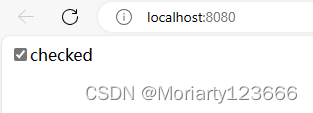

### 显示tooltip
使用:hover和:before组合，把提示文案放在span上，鼠标悬浮时显示提示信息。

```html
<!DOCTYPE html>
<html lang="en">
<head>
    <meta charset="UTF-8">
    <meta name="viewport" content="width=device-width, initial-scale=1.0">
    <title>Document</title>
</head>
<body>
   <div class="container">
    <p >hello <span data-title="hello"> World</span></p>
   </div>
</body>
</html>

<style> 
.container {
    width: 500px;
    height: 200px;
    padding: 20px;
}
span {
    position: relative;
}
span:hover::before {
    content: attr(data-title);
    position: absolute;
    top: -150%;
    left: 50%;
    transform: translate(-50%);
    white-space: nowrap;
    background-color: #191919;
    padding: 4px;
    color: #fff;
    border-radius: 4px;
}

</style>
```
效果如下：
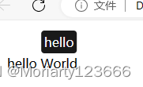

## 多列等高

多列文本展示在同一行，要控制高度一致。

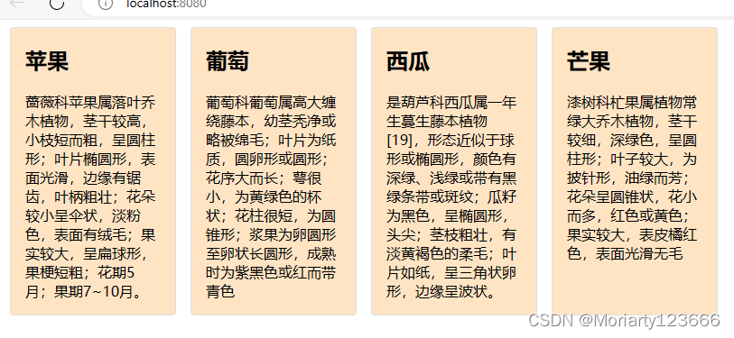

### 方式一：使用flex布局

```javascript
.container {
  width: 800px;
  display: flex;
  div {
    background-color: bisque;
    border: 1px solid #dfdfdf;
    border-radius: 4px;
    padding: 0 16px;
    margin: 0 8px;
  }
}
```

### 方式二：使用table布局

利用table的自适应特性，容器设置display为table,子元素数组display为table-cell.
```javascript 
.container {
  display: table;
  border-spacing: 8px;
  div {
    display: table-cell;
    background-color: bisque;
    border-radius: 4px;
    width: 1000px;
    p,
    h2 {
      padding: 4px 8px;
    }
  }
}
```
另一个优点是：响应式开发时，借助媒体查询动态调整display为block，从而改变排列顺序。

```javascript
@media (max-width: 500px) {
  .container {
    display: block;
    div {
      display: block;
      width: 100%;
    }
  }
}
```


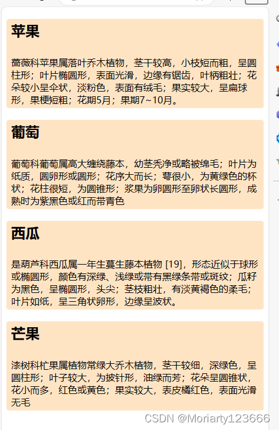


## 使用表单提交
### 参数拼接

form标签有个action属性,可以自动拼接输入框的值到网址参数中，不需要一个个的获取输入框的值

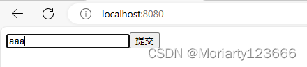

### 自动监听回车事件

如果需要做表单事件，那就监听submit事件,还可以用这个来自动监听回车事件。

```html
<!DOCTYPE html>
<html>
	<head>
		<meta charset="UTF-8">
		<title></title>
	</head>
	<body>
		
		<form id="form1" name="form1" method="post" action="" onsubmit="return fun()">
			<input type="text" name="t" id="t" />
			<input type="submit"/>
		</form>
		<script>
			function fun(){
				var t = document.getElementById("t");
				alert(t.value);
				return false;
			}
		</script>
	</body>
</html>

```

## css三角形
### 画一个三角形

```html
<!DOCTYPE html>
<html lang="en">
<head>
    <meta charset="UTF-8">
    <meta name="viewport" content="width=device-width, initial-scale=1.0">
    <title>Document</title>
</head>
<body>
    <div>
        <div class="triangle"></div>
    </div>
</body>
</html>

<style>
.triangle {
    width: 0;
    height: 0;
    border-bottom: 50px solid #000;
    border-left: 50px solid transparent;
    border-right: 50px solid transparent;
}
</style>
```


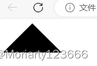

### 画一个等边三角形
三角形的高为border-bottom,三角形底为border-left/border-right * 2,高与底的比是sqrt(3) / 2
border-bottom为40px, border-left值应该为40 / sqrt(3) 约等于23px

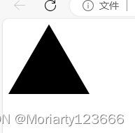

### 画消息框的三角形
消息框的左侧有一个指向左边的三角形，这个三角形可以这样画，先画一个指向左边的三角形，颜色和消息框的border一致
再画一个白色的三角形叠在上面，看起来就像突出的三角形。对面是这样的：

```css
<div class="message">Hello World</div>
.message {
    width: 200px;
    height: 50px;
    border: 1px solid #dfdfdf;
    position: relative;
    line-height: 50px;
    padding: 0px 4px;
    border-radius: 4px;
}
.message::before {
    content: '';
    position: absolute;
    top:20px;
    left: -10px;
    border-bottom: 6px solid transparent;
    border-top: 6px solid transparent;
    border-right:  10px solid #dfdfdf;
}

.message::after {
    content: '';
    position: absolute;
    top:20px;
    left: -8px;
    border-bottom: 6px solid transparent;
    border-top: 6px solid transparent;
    border-right:  10px solid white;
}
```
效果如下：

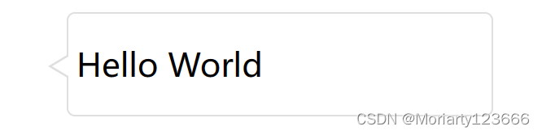


如果有阴影还可以加filter
```css
.message {
    width: 200px;
    height: 50px;
    border: 1px solid #dfdfdf;
    position: relative;
    line-height: 50px;
    padding: 0px 4px;
    border-radius: 4px;
    filter: drop-shadow(0 0 2px #999);
    background-color: #ffffff;
}
```

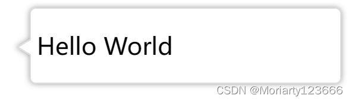


## 尽可能地使用伪元素
伪元素是一个元素的子元素，像:before/:after可以看成是元素的第一个元素或最后一个元素，且伪元素不能被js获取。优点就是可以用伪元素来制造视觉效果，又不影响dom渲染，对js是透明的。

例子：

分割线

```css
.hr {
    font-size: 14px;
     position: relative;
     text-align: center;
}
.hr::before,
.hr::after {
    content: '';
    position: absolute;
    top: 10px;
    width: 200px;
    height: 1px;
    background-color: #ccc;
}
.hr::before {
    left: 0px;
}
.hr::after {
    right: 0px;
}
```

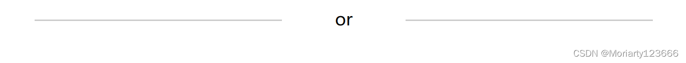

### 清除浮动
给要清除浮动加一个：after:
```css
.clear:after {
content: "";
display: table;
clear: both;
```

### 禁用所有表单项
当表单提交后，所有表单禁用，如果一个个加disabled比较麻烦，可以用after给form加一个同样大小的元素，覆盖原来的form元素
```css
    .form::after {
        content: "";
        position: absolute;
        left: 0;
        top: 0;
        width: 100%;
        height: 100%;
    }
```


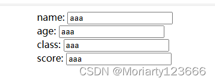

### 计算个数
counter-reset结合伪元素显示勾选的个数

```html
<!DOCTYPE html>
<html lang="en">
  <head>
    <meta charset="UTF-8" />
    <meta name="viewport" content="width=device-width, initial-scale=1.0" />
    <title>Document</title>
  </head>
  <body>
    <div class="container">
      <div class="choose">
        <label>
          <input type="checkbox" />
          苹果
        </label>
        <label>
          <input type="checkbox" />
          葡萄
        </label>
        <label>
          <input type="checkbox" />
          西瓜
        </label>
        <label>
          <input type="checkbox" />
          芒果
        </label>
      </div>
      <span>选择了<span class="count"></span>种水果</span>
    </div>
  </body>
</html>

<style>
  .container {
    width: 500px;
    margin: 0 auto;
  }
  .choose {
    counter-reset: fruit;
  }
  .choose input:checked {
    counter-increment: fruit;
  }
  .count::before {
    content: counter(fruit);
  }
</style>

```

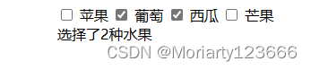