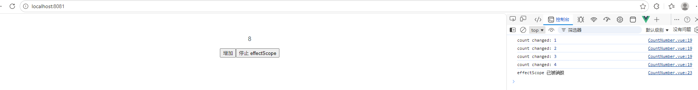

# Vue3源码解析之effectScope

## effectScope

effectScope 是 Vue 3 提供的用于管理一组响应式副作用的工具，是 Vue 3.2 引入的核心 API，用于创建副作用作用域容器，官网描述为创建一个 effect 作用域，可以捕获其中所创建的响应式副作用 (即计算属性和侦听器)，这样捕获到的副作用可以一起处理 123。

它允许将多个响应式副作用（例如 computed、watch、onMounted 等）组合到一个作用域中，并在需要时一起停止它们，能够将多个响应式副作用（如 watch、watchEffect 和 computed）组织在一起，实现统一的生命周期管理

下面是参考例子

### 代码

``` javascript
<template>
  <div class="hello">
    <p>{{ count }}</p>
    <button @click="inc">增加</button>
    <button @click="stopScope">停止 effectScope</button>
  </div>
</template>

<script setup>
import { effectScope, ref, watch } from 'vue'

const scope = effectScope()
const count = ref(0)

scope.run(() => {
  watch(count, (val) => {
    console.log('count changed:', val)
  })
})

function inc() {
  count.value++
}

function stopScope() {
  scope.stop()
}
</script>
```

### 例子
先点击四下增加，页面数据同步更新，点击停止 effectScope后再点击四下增加，页面数据不更新


## onSCopeDispose
onScopeDispose 是 Vue 3 中用于管理响应式副作用的一个重要 API，主要用于在当前活跃的 effect 作用域上注册一个处理回调函数。当这个作用域停止时，所注册的回调函数会被调用。

### 代码
``` javascript
<template>
  <div class="hello">
    <p>{{ count }}</p>
    <button @click="inc">增加</button>
    <button @click="stopScope">停止 effectScope</button>
  </div>
</template>

<script setup>
import { effectScope, ref, watch } from 'vue'

import { onScopeDispose } from 'vue'

const scope = effectScope()
const count = ref(0)

scope.run(() => {
  watch(count, (val) => {
    console.log('count changed:', val)
  })

  onScopeDispose(() => {
    console.log('effectScope 已被销毁')
  })
})

function inc() {
  count.value++
}

function stopScope() {
  scope.stop()
}
</script>
```

### 效果图

先点击四下增加，页面数据同步更新，点击停止 effectScope后再点击四下增加，页面数据不更新




## 使用场景

- **构建自清洁的组合式函数**

在自定义组合式函数中，可能会创建一些副作用，如定时器、事件监听器等。使用 `effectScope` 和 `onScopeDispose` 可以确保在组合式函数不再使用时，这些副作用能够被正确清理，避免内存泄漏。

- **与组件生命周期无缝集成**

在组件中，可以使用 `effectScope` 和 `onScopeDispose` 来管理组件内部的副作用。当组件卸载时，作用域会自动停止，所有通过 `onScopeDispose` 注册的清理函数会被执行。

- **创建可复用的非组件逻辑模块**

可以使用 `effectScope` 来封装一些可复用的非组件逻辑，这些逻辑可以在不同的组件中使用，并且能够独立管理自己的副作用。像在onScopeDispose取消接口


## 注意事项

### `effectScope`

- **嵌套作用域管理**：在嵌套的 `effectScope` 中，子作用域的生命周期依赖于父作用域。当父作用域停止时，子作用域也会停止。要确保正确管理嵌套作用域的生命周期，避免出现意外的副作用清理问题。
- **detached 选项**：`effectScope` 的 `detached` 选项用于创建一个独立于父作用域的作用域。当设置为 `true` 时，父作用域的停止不会影响子作用域。但要注意，需要手动管理该作用域的停止，否则可能会导致内存泄漏。
- **获取当前作用域**：使用 `getCurrentScope` 可以获取当前活跃的 `effectScope` 实例，常用于嵌套作用域中获取父级作用域引用。但要确保在 `effectScope` 的 `run` 方法内部调用，否则可能会返回 `null` 

### `onScopeDispose`

- **注册时机**：`onScopeDispose` 必须在 `effectScope` 的 `run` 方法内部调用，才能正确注册清理函数。如果在作用域外部调用，清理函数将不会在作用域停止时执行。
- **清理函数顺序**：在同一个作用域中，多个 `onScopeDispose` 注册的清理函数将按照注册的顺序逆序执行。确保清理函数之间不会相互依赖，避免出现意外的清理顺序问题。
- **异步操作清理**：对于异步操作，如 `Promise` 或 `async/await`，要确保在清理函数中处理好未完成的异步任务，避免出现内存泄漏或未处理的错误。


## 可能出现的问题

- effectScopd中run()和stop()没有配对使用，可能会导致内存泄漏的问题
- 避免滥用，简单的组件中effectWatch已能满足要求
