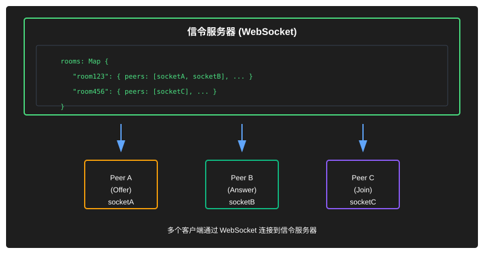
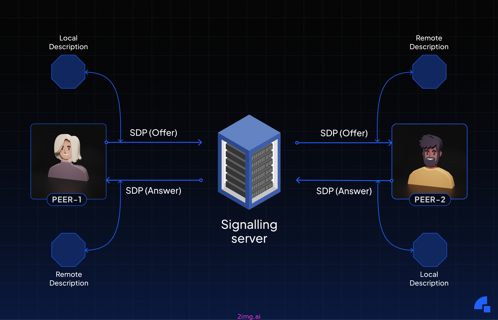
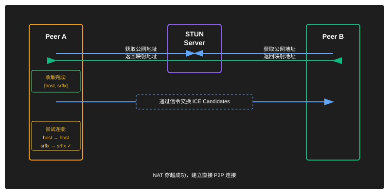
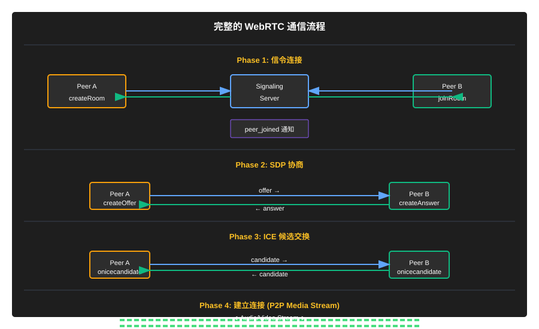

# WebRTC 通信原理详解

## 一、WebRTC 概述

WebRTC（Web Real-Time Communication）是一项支持网页浏览器进行实时语音对话或视频对话的技术，它允许在浏览器之间直接建立点对点连接，无需中间服务器转发数据。

### 核心特点

- **实时性**: 低延迟，适合音视频通话
- **点对点**: 数据直接在客户端之间传输
- **安全性**: 强制使用加密（SRTP/DTLS）
- **跨平台**: 支持主流浏览器和移动平台

---

我编写了一个web应用，用于对webRtc进行示例，代码放在了gitee

https://gitee.com/Moriarty123/web-rtc.git

## 二、WebRTC 核心组件

### 1. MediaStream（媒体流）

用于获取和处理音视频流，通过 `getUserMedia` API 获取设备摄像头和麦克风数据。

```javascript
// 示例：获取本地媒体流（来自 webrtc-handler.js）
async initializeLocalStream() {
    this.localStream = await navigator.mediaDevices.getUserMedia({
        video: {
            width: { ideal: 1280 },
            height: { ideal: 720 },
            facingMode: 'user'
        },
        audio: {
            echoCancellation: true,
            noiseSuppression: true
        }
    });
    return this.localStream;
}
```

### 2. RTCPeerConnection（对等连接）

核心组件，负责建立和管理点对点连接。主要职责：
- SDP 协商
- ICE 候选收集
- 媒体流传输
- 连接状态管理

```javascript
// 示例：创建 PeerConnection（来自 webrtc-handler.js）
createPeerConnection() {
    this.peerConnection = new RTCPeerConnection(RTCConfiguration);
    
    // ICE 候选收集回调
    this.peerConnection.onicecandidate = (event) => {
        if (event.candidate) {
            if (this.onIceCandidate) {
                this.onIceCandidate(event.candidate);
            }
        }
    };
    
    // 远端流接收回调
    this.peerConnection.ontrack = (event) => {
        if (this.onRemoteStream) {
            this.onRemoteStream(event.streams[0]);
        }
    };
}
```

### 3. RTCDataChannel（数据通道）

用于传输任意数据（非音视频），支持可靠和不可靠传输模式。

---

## 三、信令机制（Signaling）

### 为什么需要信令？

WebRTC 无法直接建立连接，需要通过信令服务器交换以下信息：
- **SDP（Session Description Protocol）**: 会话描述，包含媒体能力、编解码器等
- **ICE 候选**: 网络地址信息，用于建立直接连接
- **控制消息**: 房间管理、用户加入/离开等

### 信令服务器架构



### 信令消息类型

| 消息类型 | 作用 | 发送方 |
|---------|------|--------|
| `create_room` | 创建房间 | 发起方 |
| `join_room` | 加入房间 | 接收方 |
| `offer` | 发送 SDP Offer | 发起方 |
| `answer` | 发送 SDP Answer | 接收方 |
| `ice_candidate` | 发送 ICE 候选 | 双方 |
| `peer_joined` | 通知对方加入 | 服务器 |
| `peer_left` | 通知对方离开 | 服务器 |

---

## 四、SDP 协商过程

SDP（Session Description Protocol）描述了媒体会话的参数，包括：
- 媒体类型（音频/视频）
- 编解码器类型
- 网络传输协议
- 时间戳和同步信息

### Offer/Answer 流程



### 代码示例

```javascript
// 发起方创建 Offer（来自 webrtc-handler.js）
async createOffer() {
    if (!this.peerConnection) {
        this.createPeerConnection();
    }
    
    const offer = await this.peerConnection.createOffer({
        offerToReceiveAudio: true,
        offerToReceiveVideo: true
    });
    await this.peerConnection.setLocalDescription(offer);
    return offer;
}

// 接收方创建 Answer
async createAnswer(offer) {
    if (!this.peerConnection) {
        this.createPeerConnection();
    }
    
    await this.peerConnection.setRemoteDescription(new RTCSessionDescription(offer));
    const answer = await this.peerConnection.createAnswer();
    await this.peerConnection.setLocalDescription(answer);
    return answer;
}
```

---

## 五、ICE 框架

ICE（Interactive Connectivity Establishment）是一种 NAT 穿越技术，用于在不同网络环境下建立直接连接。

### ICE 候选类型

| 候选类型 | 说明 | 优先级 |
|---------|------|--------|
| **host** | 本地 IP 地址（局域网） | 最高 |
| **srflx** | STUN 反射地址（公网映射） | 中等 |
| **relay** | TURN 中继地址（无法直连时） | 最低 |

### STUN 服务器

用于获取公网 IP 地址，本项目使用 Google 的公共 STUN 服务器：

```javascript
const RTCConfiguration = {
    iceServers: [
        { urls: 'stun:stun.l.google.com:19302' },
        { urls: 'stun:stun1.l.google.com:19302' }
    ]
};
```

### ICE 收集与交换流程



---

## 六、完整通信流程



---

## 七、项目代码架构

### 目录结构

```
webrtc/
├── client/
│   ├── index.html          # 前端页面
│   ├── css/style.css       # 样式
│   └── js/
│       ├── main.js         # 主入口，UI 逻辑
│       ├── signaling-client.js  # 信令客户端封装
│       └── webrtc-handler.js    # WebRTC 核心逻辑封装
├── server/
│   └── signaling-server.js  # 信令服务器（WebSocket）
└── package.json
```

### 核心文件职责

| 文件 | 职责 | 关键功能 |
|------|------|----------|
| `signaling-server.js` | 信令服务器 | 房间管理、消息转发、心跳检测 |
| `signaling-client.js` | 信令客户端 | WebSocket 连接、消息收发、事件监听 |
| `webrtc-handler.js` | WebRTC 处理 | 媒体流管理、PeerConnection、SDP/ICE 处理 |
| `main.js` | 主入口 | UI 交互、状态管理、流程编排 |

---

## 八、关键技术要点

### 1. 连接状态管理

```javascript
// 连接状态枚举
connectionState: new → connecting → checking → connected → disconnected → failed → closed

// 状态监听（来自 webrtc-handler.js）
this.peerConnection.onconnectionstatechange = () => {
    console.log('连接状态:', this.peerConnection.connectionState);
};
```

### 2. 心跳检测机制

服务器定期发送 ping 检测客户端存活状态：

```javascript
// 来自 signaling-server.js
const heartbeatInterval = setInterval(() => {
    wss.clients.forEach((socket) => {
        if (!socket.isAlive) {
            socket.terminate();
            return;
        }
        socket.isAlive = false;
        socket.ping();
    });
}, 30000);
```

### 3. 媒体轨道管理

```javascript
// 添加本地轨道到 PeerConnection
this.localStream.getTracks().forEach(track => {
    this.peerConnection.addTrack(track, this.localStream);
});

// 接收远端轨道
this.peerConnection.ontrack = (event) => {
    remoteVideo.srcObject = event.streams[0];
};
```

---

## 九、常见问题与解决方案

### 1. 无法建立连接

**可能原因**:
- 防火墙阻止 WebSocket 连接
- NAT 类型不兼容（对称 NAT 需要 TURN 服务器）
- STUN 服务器不可用

**解决方案**:
- 检查网络环境，确保端口开放
- 添加 TURN 服务器支持
- 使用多个 STUN 服务器提高可靠性

### 2. 音视频卡顿

**可能原因**:
- 网络带宽不足
- 编解码器不兼容
- 设备性能限制

**解决方案**:
- 调整分辨率和帧率
- 启用自适应比特率
- 使用硬件加速

### 3. 跨域问题

**解决方案**:
- 配置 WebSocket 服务器支持 CORS
- 使用 HTTPS 协议
- 设置正确的 Origin 头

---

## 十、扩展建议

1. **添加 TURN 服务器**: 解决极端 NAT 环境下的连接问题
2. **支持屏幕共享**: 使用 `getDisplayMedia` API
3. **多人通话**: 实现 SFU（Selective Forwarding Unit）架构
4. **数据通道**: 利用 RTCDataChannel 传输文本消息或文件
5. **质量监控**: 集成 WebRTC Stats API 监控通话质量

---

## 附录：参考资料

- [WebRTC 官方文档](https://webrtc.org/)
- [MDN WebRTC 指南](https://developer.mozilla.org/zh-CN/docs/Web/API/WebRTC_API)
- [SDP 协议规范](https://tools.ietf.org/html/rfc4566)
- [ICE 协议规范](https://tools.ietf.org/html/rfc5245)
